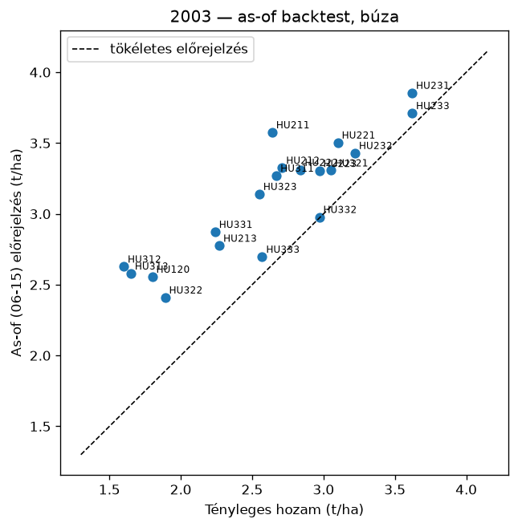
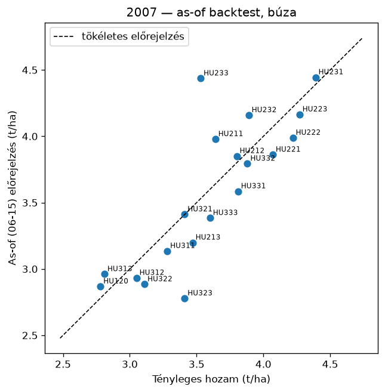
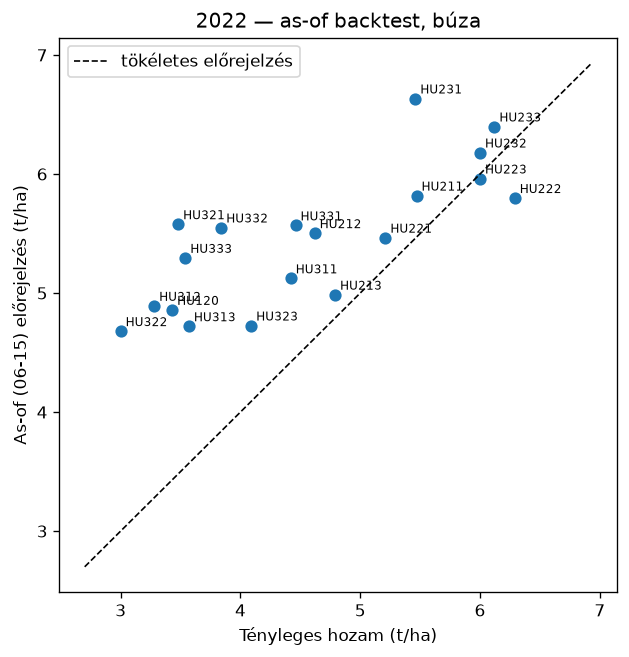

# Backtest riport — búzahozam-előrejelző (mérési kapu)

*Készült: 2026-07-10. Adat: KSH vármegyei búza-termésátlag (2000–2025), ERA5 (Open-Meteo), 19 vármegye (Budapest kihagyva — elhanyagolható termőterület).*

## 1. Modell

Panelregresszió: vármegye-fixhatás + közös lineáris időtrend (a technológiai fejlődés leválasztására) + standardizált időjárási mutatók (ablakos GDD-k, csapadék, hőstressznapok, vízmérleg-mutatók, halmozott vízmérleg-deficit). Becslés: OLS szelektív ridge büntetéssel (α=25.0, csak az időjárási blokkon; LOYO ráccsal választva).

## 2. Leave-one-year-out validáció (out-of-sample)

| Modell | RMSE (t/ha) | RMSE (%) | R² |
|---|---|---|---|
| **panelmodell** | 0.529 | 11.4% | 0.725 |
| naiv: vármegye-trend | 0.682 | 14.7% | 0.542 |
| naiv: előző 3 év átlaga | 0.780 | 16.8% | 0.402 |

A bizonytalansági sáv a LOYO reziduumok szórásából: ±1.282·0.529 t/ha (névleges 80%); tényleges lefedettség **82.0%**.

## 3. As-of backtest (06. hó 15. napi tudásállapot)

A feature-ök a célév as-of napjáig ismert időjárásból + a hátralévő napokra a többi év klimatológiájából; a modell a célév nélkül tanítva (nincs look-ahead).

| Év | Jósolt anomália (átlag) | Tényleges anomália (átlag) | Iránytalálat (vármegye) |
|---|---|---|---|
| 2003 | -21.3% | -34.2% | 19/19 |
| 2007 | -15.4% | -14.2% | 19/19 |
| 2022 | -1.8% | -18.1% | 14/19 |

### 2022 vármegyénként (a leginkább érintettől a legkevésbé érintettig)

| Vármegye | Tényleges anomália | Jósolt anomália | Irány |
|---|---|---|---|
| Jász-Nagykun-Szolnok | -39.8% | -6.0% | ✔ |
| Hajdú-Bihar | -39.4% | -2.8% | ✔ |
| Heves | -35.7% | -4.1% | ✔ |
| Csongrád-Csanád | -32.6% | +0.9% | ✘ |
| Pest | -32.3% | -4.1% | ✔ |
| Békés | -30.1% | +1.0% | ✘ |
| Nógrád | -27.5% | -4.2% | ✔ |
| Szabolcs-Szatmár-Bereg | -22.5% | -10.4% | ✔ |
| Bács-Kiskun | -19.9% | +0.0% | ✘ |
| Borsod-Abaúj-Zemplén | -19.2% | -6.3% | ✔ |
| Komárom-Esztergom | -17.4% | -1.6% | ✔ |
| Baranya | -14.9% | +3.3% | ✘ |
| Fejér | -8.6% | -2.7% | ✔ |
| Győr-Moson-Sopron | -6.3% | -1.7% | ✔ |
| Veszprém | -5.4% | -1.5% | ✔ |
| Tolna | -3.1% | +1.3% | ✘ |
| Somogy | +0.2% | +3.2% | ✔ |
| Zala | +1.8% | +1.1% | ✔ |
| Vas | +9.1% | +0.6% | ✔ |

## 4. A mérési kapu értékelése

- **(a) Naiv alap verése:** lásd a 2. táblázatot.
- **(b) 2022 iránytartás:** 14/19 vármegyénél helyes az előjel, a 10 leginkább érintettből 7-nál.
- **(c) Sáv realitása:** 82.0% tényleges lefedettség a névleges 80%-ra.

### Ismert korlátok (őszintén)

- **A 2022-es anomália MÉRTÉKÉT a modell alulbecsüli** (jún. 15-i átlag -1.8% a tényleges -18.1% helyett). Két ok: (1) a június végi hőhullám a jún. 15-i tudásállapotban még nem ismert — a teljes szezonos (LOYO) becslés már −5,5%-ot ad; (2) 2022-ben a műtrágyaár-robbanás (háború) is csökkentette a hozamot, ami nem időjárási tényező, egy időjárás-alapú modell elvben sem foghatja meg.
- A halmozott vízmérleg-deficit (wb_deficit) bevezetése a kapu-iteráció eredménye: az összesített out-of-sample RMSE-t 0,624-ről 0,529 t/ha-ra javította, és a 2012-es aszályt is 19/19-re hozza.
- A modell szezonon belüli frissítéssel (5. fázis) az as-of nap utáni időjárást is beépíti, a 2022-szerű késői stresszt is követve.