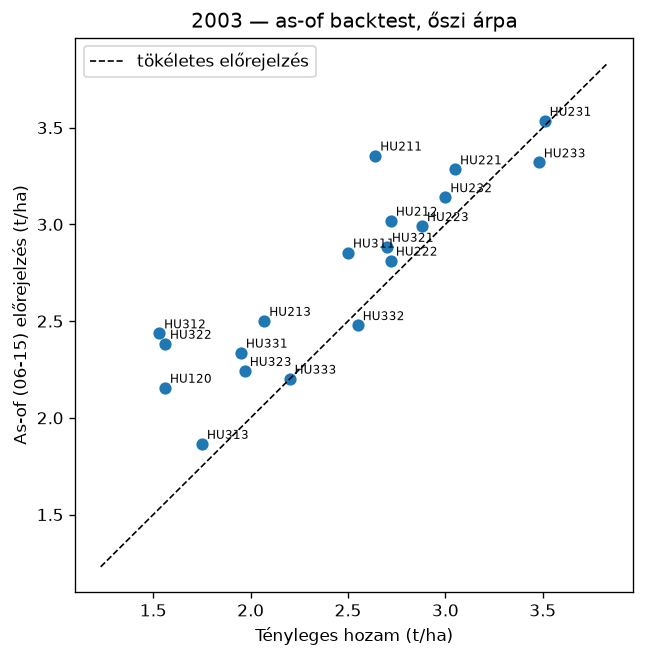
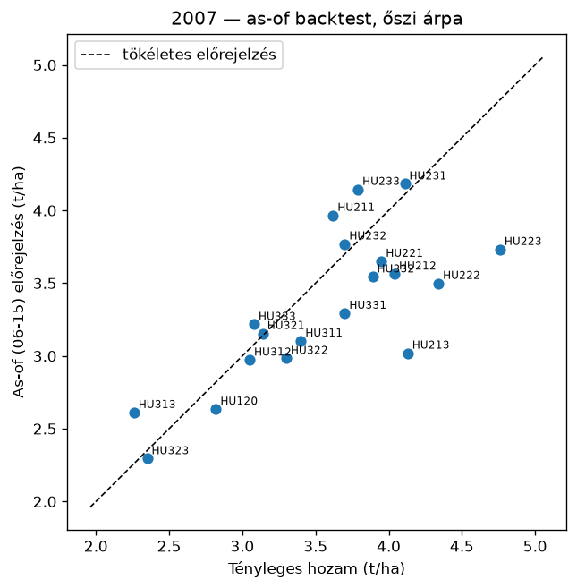
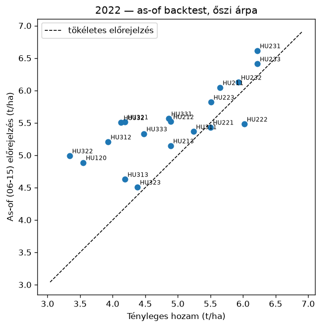

# Backtest riport — őszi árpahozam-előrejelző (mérési kapu)

*Készült: 2026-07-14. Adat: KSH vármegyei őszi árpa-termésátlag (2000–2025), ERA5 (Open-Meteo), 19 vármegye (Budapest kihagyva — elhanyagolható termőterület).*

## 1. Modell

Panelregresszió: vármegye-fixhatás + közös lineáris időtrend (a technológiai fejlődés leválasztására) + standardizált időjárási mutatók (ablakos GDD-k, csapadék, hőstressznapok, vízmérleg-mutatók, halmozott vízmérleg-deficit). Becslés: OLS szelektív ridge büntetéssel (α=25.0, csak az időjárási blokkon; LOYO ráccsal választva).

## 2. Leave-one-year-out validáció (out-of-sample)

| Modell | RMSE (t/ha) | RMSE (%) | R² |
|---|---|---|---|
| **panelmodell** | 0.545 | 12.1% | 0.776 |
| naiv: vármegye-trend | 0.693 | 15.4% | 0.637 |
| naiv: előző 3 év átlaga | 0.802 | 17.8% | 0.514 |

A bizonytalansági sáv a LOYO reziduumok szórásából: ±1.282·0.545 t/ha (névleges 80%); tényleges lefedettség **81.8%**.

## 3. As-of backtest (06. hó 15. napi tudásállapot)

A feature-ök a célév as-of napjáig ismert időjárásból + a hátralévő napokra a többi év klimatológiájából; a modell a célév nélkül tanítva (LOYO-konvenció: a célév kizárva, de a célév UTÁNI évek benne vannak a tanításban és a klimatológiában — egy valódi korabeli futás ennél kevesebb adatot látott volna).

| Év | Jósolt anomália (átlag) | Tényleges anomália (átlag) | Iránytalálat (vármegye) |
|---|---|---|---|
| 2003 | -23.5% | -32.0% | 19/19 |
| 2007 | -15.1% | -9.4% | 14/19 |
| 2022 | -3.4% | -13.8% | 15/19 |

### 2022 vármegyénként (a leginkább érintettől a legkevésbé érintettig)

| Vármegye | Tényleges anomália | Jósolt anomália | Irány |
|---|---|---|---|
| Jász-Nagykun-Szolnok | -37.8% | -7.1% | ✔ |
| Pest | -31.5% | -5.7% | ✔ |
| Heves | -28.0% | -4.6% | ✔ |
| Hajdú-Bihar | -26.9% | -3.8% | ✔ |
| Békés | -26.1% | -1.5% | ✔ |
| Csongrád-Csanád | -16.6% | -0.8% | ✔ |
| Nógrád | -14.3% | -5.4% | ✔ |
| Komárom-Esztergom | -14.3% | -3.2% | ✔ |
| Bács-Kiskun | -13.6% | -1.1% | ✔ |
| Szabolcs-Szatmár-Bereg | -12.9% | -10.4% | ✔ |
| Fejér | -9.8% | -3.5% | ✔ |
| Borsod-Abaúj-Zemplén | -8.7% | -6.6% | ✔ |
| Zala | -8.1% | -2.9% | ✔ |
| Veszprém | -7.3% | -2.4% | ✔ |
| Győr-Moson-Sopron | -4.6% | -5.8% | ✔ |
| Baranya | -4.0% | +2.1% | ✘ |
| Tolna | -2.6% | +0.4% | ✘ |
| Somogy | -1.1% | +2.2% | ✘ |
| Vas | +5.2% | -4.2% | ✘ |

## 4. A mérési kapu értékelése

- **(a) Naiv alap verése:** lásd a 2. táblázatot.
- **(b) 2022 iránytartás:** 15/19 vármegyénél helyes az előjel, a 10 leginkább érintettből 10-nál.
- **(c) Sáv realitása:** 81.8% tényleges lefedettség a névleges 80%-ra.