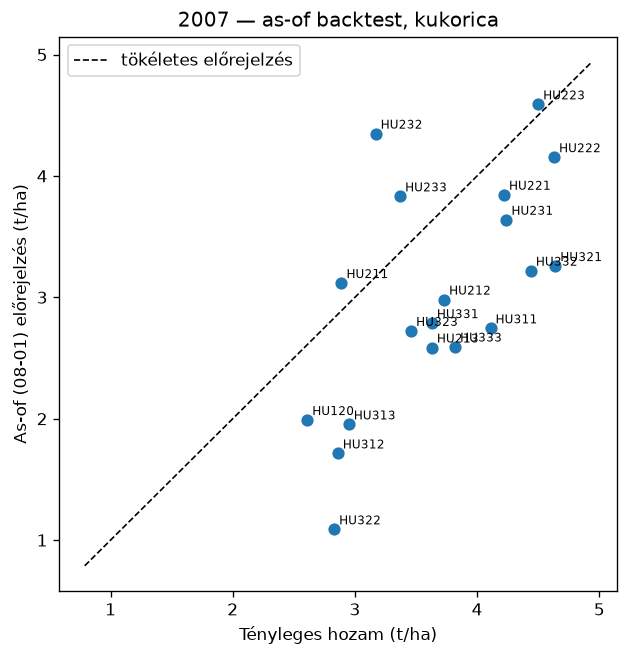
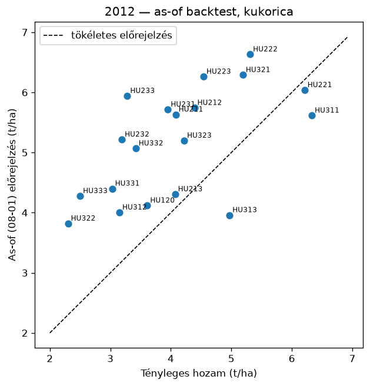
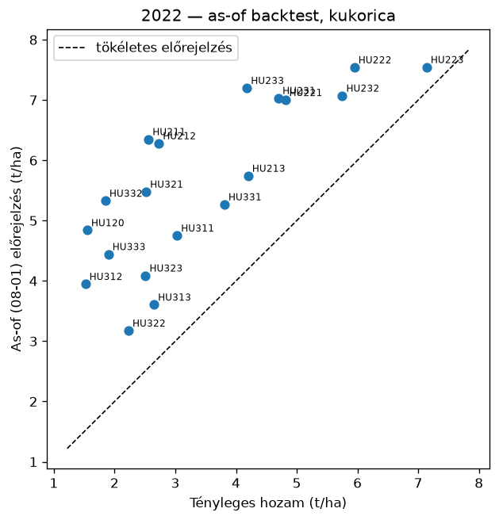

# Backtest riport — kukoricahozam-előrejelző (mérési kapu)

*Készült: 2026-07-10. Adat: KSH vármegyei kukorica-termésátlag (2000–2025), ERA5 (Open-Meteo), 19 vármegye (Budapest kihagyva — elhanyagolható termőterület).*

## 1. Modell

Panelregresszió: vármegye-fixhatás + közös lineáris időtrend (a technológiai fejlődés leválasztására) + standardizált időjárási mutatók (ablakos GDD-k, csapadék, hőstressznapok, vízmérleg-mutatók, halmozott vízmérleg-deficit). Becslés: OLS szelektív ridge büntetéssel (α=25.0, csak az időjárási blokkon; LOYO ráccsal választva).

## 2. Leave-one-year-out validáció (out-of-sample)

| Modell | RMSE (t/ha) | RMSE (%) | R² |
|---|---|---|---|
| **panelmodell** | 1.396 | 22.9% | 0.427 |
| naiv: vármegye-trend | 1.725 | 28.3% | 0.125 |
| naiv: előző 3 év átlaga | 1.864 | 30.6% | -0.021 |

A bizonytalansági sáv a LOYO reziduumok szórásából: ±1.282·1.397 t/ha (névleges 80%); tényleges lefedettség **85.0%**.

## 3. As-of backtest (08. hó 1. napi tudásállapot)

A feature-ök a célév as-of napjáig ismert időjárásból + a hátralévő napokra a többi év klimatológiájából; a modell a célév nélkül tanítva (LOYO-konvenció: a célév kizárva, de a célév UTÁNI évek benne vannak a tanításban és a klimatológiában — egy valódi korabeli futás ennél kevesebb adatot látott volna).

| Év | Jósolt anomália (átlag) | Tényleges anomália (átlag) | Iránytalálat (vármegye) |
|---|---|---|---|
| 2007 | -49.5% | -36.9% | 19/19 |
| 2012 | -16.0% | -33.0% | 17/19 |
| 2022 | -21.8% | -52.1% | 19/19 |

### 2022 vármegyénként (a leginkább érintettől a legkevésbé érintettig)

| Vármegye | Tényleges anomália | Jósolt anomália | Irány |
|---|---|---|---|
| Pest | -76.8% | -27.5% | ✔ |
| Heves | -75.1% | -35.3% | ✔ |
| Békés | -73.8% | -24.5% | ✔ |
| Csongrád-Csanád | -69.7% | -29.0% | ✔ |
| Hajdú-Bihar | -68.3% | -31.0% | ✔ |
| Fejér | -66.7% | -17.4% | ✔ |
| Szabolcs-Szatmár-Bereg | -63.9% | -41.2% | ✔ |
| Komárom-Esztergom | -63.7% | -16.5% | ✔ |
| Jász-Nagykun-Szolnok | -60.7% | -44.1% | ✔ |
| Borsod-Abaúj-Zemplén | -58.6% | -35.0% | ✔ |
| Nógrád | -53.5% | -36.8% | ✔ |
| Tolna | -49.0% | -12.1% | ✔ |
| Bács-Kiskun | -43.9% | -22.3% | ✔ |
| Baranya | -41.4% | -12.3% | ✔ |
| Győr-Moson-Sopron | -35.1% | -5.5% | ✔ |
| Veszprém | -34.5% | -10.4% | ✔ |
| Somogy | -26.7% | -9.8% | ✔ |
| Vas | -22.3% | -1.5% | ✔ |
| Zala | -6.8% | -1.5% | ✔ |

## 4. A mérési kapu értékelése

- **(a) Naiv alap verése:** lásd a 2. táblázatot.
- **(b) 2022 iránytartás:** 19/19 vármegyénél helyes az előjel, a 10 leginkább érintettből 10-nál.
- **(c) Sáv realitása:** 85.0% tényleges lefedettség a névleges 80%-ra.